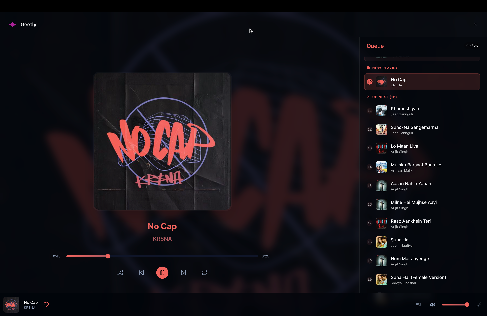
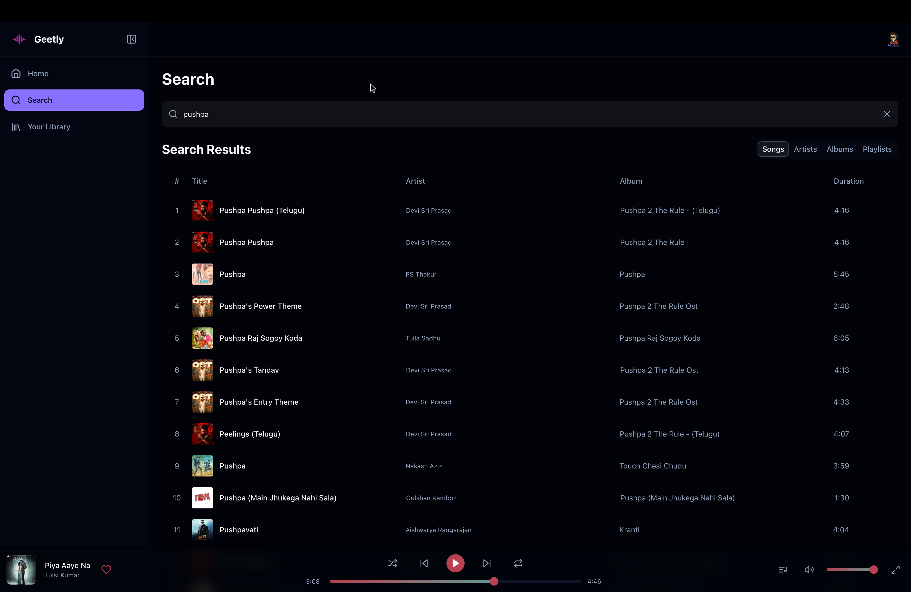
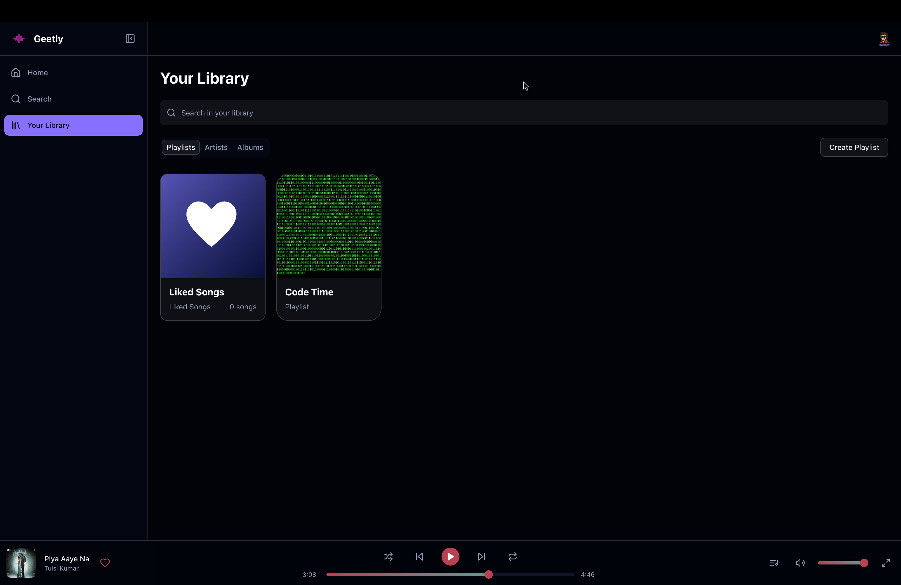

  

<h1 align="center">
  Geetly – Your Gateway to Free, Ad-Free Music Streaming
</h1>

 

 

> **Website:** [https://geetly.rajkar.me](https://geetly.rajkar.me)  
> **Status:** Live & Actively Maintained  
> **Try Now →** [https://geetly.vercel.app](https://geetly.rajkar.me)

---

## 🚀 What is Geetly?

**Geetly** is a Progressive Web App (PWA) designed to redefine the way people experience music. It’s a **completely free, ad-free music streaming platform**, offering an elegant, seamless user experience across devices.

No subscriptions. No interruptions. Just pure music.

---

## ✨ Key Highlights

### ✅ 100% Free – Forever
No hidden charges, no premium tiers, and no trial traps. Geetly gives **unlimited access to a full music library** without asking for a single rupee.

### 🚫 Zero Ads
Experience **true uninterrupted playback** with absolutely no ads – ever. Enjoy music the way it’s meant to be heard.

### 🎧 Diverse & Expansive Library
From **Bollywood’s latest hits** by Arijit Singh and Shreya Ghoshal to **timeless classics** by legends like Lata Mangeshkar – Geetly celebrates music in all its forms:
- 🎶 Trending Songs
- 🎤 Popular Artists
- 🕉️ Devotional Tracks
- 🌍 Regional and Global Hits

### 📱 PWA-Ready & Cross-Platform
Install Geetly on any device – mobile, tablet, or desktop – with our blazing fast PWA experience. Your music goes wherever you do.

---

### 📸 App Screenshots

| Feature | Preview |
|--------|---------|
| **Home Page** |  |
| **Player with Queue** |  |
| **Smart Search** |  |
| **Personalized Playlists** |  |

---

## 🎯 Features at a Glance

- 🚀 **Fast & Smooth Playback** – Adaptive streaming with minimal buffering
- 🔍 **Smart Search** – Find tracks, artists, or albums instantly
- ❤️ **Trending Now & Fresh Releases** – Stay ahead of the curve
- 🔁 **Recently Added** – Discover new gems every day
- 🌟 **Artist Discovery** – Discover emerging and legendary artists alike
- 📲 **Installable App (PWA)** – One-click install on Android, iOS, Desktop

---

## 🌍 Why Geetly?

In a world of overpriced, ad-heavy streaming platforms, **Geetly is a breath of fresh air**:

| 🎵 | Premium Platforms | Geetly |
|----|-------------------|--------|
| 💰 Subscription Required | Yes | **No** |
| 🚫 Ads Interrupting Playback | Yes | **Never** |
| 🎧 Installable PWA | Sometimes | **Yes** |
| 📂 Unlimited Library Access | Tiered | **Full Access** |
| 🌐 Accessible to All | Limited | **Yes – Global** |

> **"Because great music should be free and accessible to everyone."**

---

## 💡 Our Vision

> Music is not a product – it’s an emotion.  
> At Geetly, we believe in **breaking down the barriers** between people and the music they love. Whether you're vibing to Bollywood beats or immersing in classical soul, Geetly is your platform.

---

## 📦 Tech Stack

- **Frontend:** React, TailwindCSS, Next.js
- **Backend:** Supabase (PostgreSQL), Node.js
- **Media Storage:** Supabase Buckets
- **Authentication:** Supabase Auth
- **Performance:** Vercel Edge Functions
- **Offline Support:** PWA + Service Workers

---

## 🤝 For Artists & Users

### 🎤 For Artists:
Your music deserves to be heard. We're building a platform that **celebrates diverse voices** and helps new artists reach the world.

### 🎧 For Listeners:
No limits. No ads. No distractions. Just music that moves you.

---

## 🛠️ Roadmap (Coming Soon)

- 🧠 Smart AI Recommendations  
- 🌐 Language Filters  
- 🔄 Offline Download Support  
- 📱 Native App
---

## 🔐 Note on Source Code

> Due to the complexity and time investment behind this project, **source code is not open to the public**.  
> However, I'm happy to provide detailed breakdowns, architecture overviews, and tech demos upon request.

---

## 🙌 Join the Geetly Movement

- 🌟 Try Geetly: [https://geetly.rajkar.me](https://geetly.rajkar.me)  
- 🐦 Connect: [LinkedIn](https://www.linkedin.com/in/raj-kar-40b7281a3/)  
- 📩 Contact Me: contact@rajkar.me  

---

## 📢 License & Credits

All media used in the app is for educational/demonstration purposes only.  
If you’re an artist and want your content removed or featured, reach out!

---

## 🌟 Final Words

> At **Geetly**, we’re not just building a music app – we’re building a culture.  
> Join thousands of listeners who believe that music should be **free, beautiful, and boundaryless**.

🎵 Welcome to Geetly – _where your musical journey knows no bounds._

---
